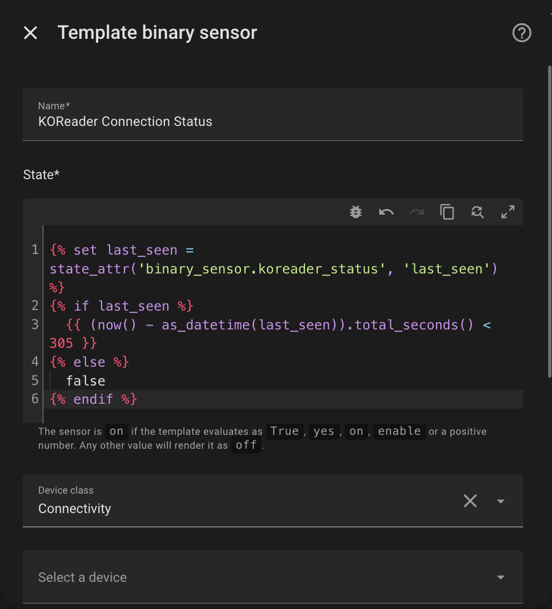

# heartbeat.koplugin (experimental)

<p align="center">

  <i></i>
</p>

<p align="center">

  <i>KOReader status sensor in Home Assistant & its attributes</i>
</p>

## Features
This plugin updates a Home Assistant binary sensor with KOReader’s status, so you can build automations around reading activity, device wake/sleep events and book metadata.

Reported attributes include `device_model`, `book_title`, `book_author`, `battery_level`, `is_charging`, and `last_seen`.

<br>

> **If you want to control Home Assistant devices from within KOReader, check out [homeassistant.koplugin](https://github.com/moritz-john/homeassistant.koplugin)**

## Installation

### Step 1: Download the Plugin
[Download the latest release](https://github.com/moritz-john/heartbeat.koplugin/releases) and unpack `heartbeat.koplugin.zip`. 

### Step 2: Edit `heartbeat_config.lua`

Edit `heartbeat_config.lua` with the connection details for your Home Assistant instance.  
Update `host`, `port`, `https`, and `token` to match your setup:

```lua
return {
    host = "192.168.1.10",
    port = 8123,
    https = false,
    token =
    "PasteYourHomeAssistantLong-LivedAccessTokenHere",
}
```

> [!tip]
> **How to create a Long-Lived Access Token:**  
> [**Home Assistant**](https://my.home-assistant.io/redirect/profile): *Profile → Security (scroll down) → Long-lived access tokens → Create token*  
> *Copy the token now – you won’t be able to view it again.*

### Step 3: Copy Files to Your Device 

After editing `heartbeat_config.lua`, copy the entire `heartbeat.koplugin` folder to your KOReader device:  
`koreader/plugins/`

### Step 4: Restart KOReader

The plugin appears under **Tools → Page X → Heartbeat Configuration**

## Settings & Notes

Long-press any menu entry in **Heartbeat Configuration** to see a short explanation of that setting.

<br>

> [!NOTE]
> `heartbeat.koplugin` sends updates on wake, sleep, document open & close, with optional periodic updates while awake. If KOReader has no Wi-Fi connection, updates are skipped. If Home Assistant is unavailable, heartbeat requests fail silently. Wake updates are sent with an 8-second delay (default) but is adjustable. Some events may not work reliably on all devices.

## Kobo "off" State Workaround

If your device does not send the `"off"` state (for example some Kobo devices), you can create a Home Assistant template binary sensor instead.

Set the timeout to your **Heartbeat Update Interval** plus a small buffer.  
Example for an update interval of `300` seconds:

<p align="center">

</p>

```yaml


  {{ (now() - as_datetime(last_seen)).total_seconds() < 305 }}

  false

```

This template sensor stays `"on"` while heartbeats are still recent, and turns `"off"` automatically when they stop.

## Screenshots

<p align="center">

</p>

<p align="center">

</p>

## Requirements
- KOReader (tested with: 2025.10 "Ghost" on a Kindle Basic 2024)  
- Home Assistant & a Long-Lived Access Token