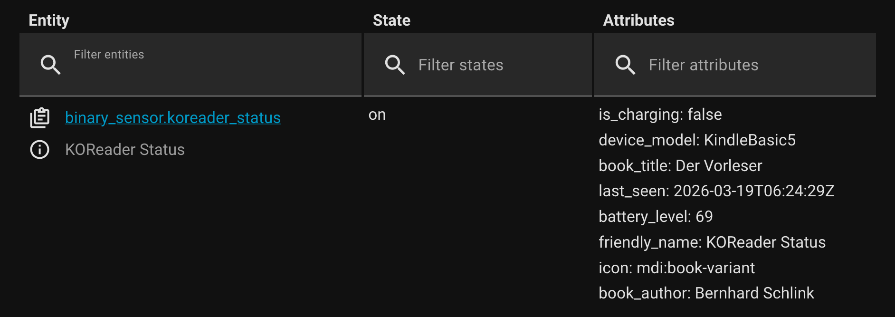
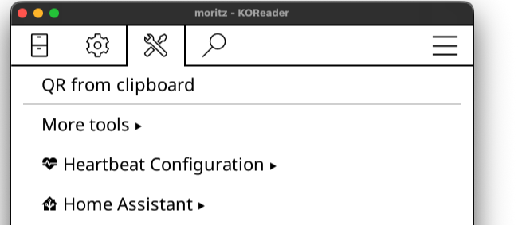
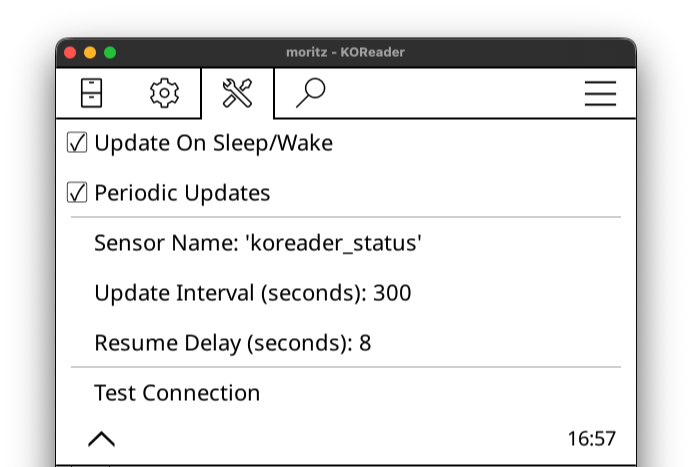

# heartbeat.koplugin (experimental)

<p align="center">

  <i></i>
</p>

<p align="center">

  <i>KOReader status sensor in Home Assistant & its attributes</i>
</p>

## Features

The plugin can send KOReader's current state ("a heartbeat") to a Home Assistant binary sensor. This sensor can be used to trigger automations based on your reading activity.

The binary sensor includes the following attributes: `device_model`, `book_title`, `book_author`, `current_page`, `total_pages`, `pages_remaining`, `reading_progress`, `battery_level`, `is_charging`, and `last_seen`.

### Separate Home Assistant sensors (REST)

After a successful heartbeat, the plugin also updates separate `sensor.*` entities via Home Assistant’s [States API](https://www.home-assistant.io/integrations/http/#post-apistatesentity_id) (`POST /api/states/sensor.<entity_id>`). This makes book and reading fields easier to use in automations and dashboards.

**Naming:** the sensor entity id prefix is derived from the configured binary sensor name (`heartbeat_name` in settings). If the name ends with `_status`, that suffix is stripped; otherwise the full name is used as the prefix.

Examples when `heartbeat_name` is `koreader_status` (default):

| Entity id | Typical state | Notes |
|-----------|---------------|--------|
| `sensor.koreader_book_title` | book title | |
| `sensor.koreader_book_author` | author | |
| `sensor.koreader_current_page` | page number | |
| `sensor.koreader_total_pages` | page count | |
| `sensor.koreader_pages_remaining` | pages left | |
| `sensor.koreader_reading_progress` | 0–100 | `unit_of_measurement`: `%` |

**Last-known values:** updates are skipped when a value would be JSON `null`, so Home Assistant can keep the previous numeric or string state until KOReader sends a new value (for example after suspend or when no document is open).

## Installation

### Step 1: Download the Plugin
[Download the latest release](https://github.com/moritz-john/heartbeat.koplugin/releases) and unpack `heartbeat.koplugin.zip`:  

### Step 2: Edit `heartbeat_config.lua`

Add your Home Assistant connection details.  
Change `host`, `port`, `https` and `token` according to your personal setup:

```lua
return {
    host = "192.168.1.10",
    port = 8123,
    https = false,
    token =
    "PasteYourHomeAssistantLong-LivedAccessTokenHere",
}
```

> [!tip]
> **How to create a Long-Lived Access Token:**  
> [**Home Assistant**](https://my.home-assistant.io/redirect/profile): *Profile → Security (scroll down) → Long-lived access tokens → Create token*  
> *Copy the token now – you won’t be able to view it again.*

### Step 3: Copy Files to Your Device

After editing `heartbeat_config.lua`, copy the files to your KOReader device:

**Copy the entire `heartbeat.koplugin` folder into `koreader/plugins/`**  

### Step 4: Restart KOReader

The plugin appears under **Tools → Page 2 → Heartbeat Configuration**

## Settings & Caveats

Long press a menu entry in **Heartbeat Configuration** to get an explanation of what each setting does.

<br>

> [!NOTE] 
> `heartbeat.koplugin` assumes that KOReader has Wi-Fi connectivity. State updates are sent on start/resume/suspend & document open/close and will fail silently if Home Assistant or Wi-Fi is unavailable. The resume state is sent with an 8-second delay (default) but is adjustable. Not every state update action works on every device.

## Screenshots

<p align="center">

</p>

<p align="center">

</p>

## Requirements
- KOReader (tested with: 2025.10 "Ghost" on a Kindle Basic 2024)  
- Home Assistant & a Long-Lived Access Token